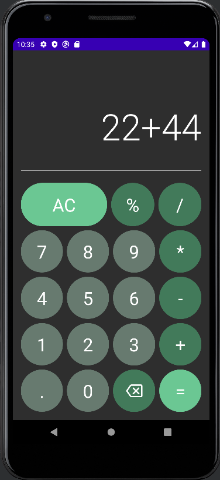

# Kalkulator

Jest to prosta aplikacja kalkulatora napisana w języku Kotlin przy użyciu frameworka Compose. Aplikacja pozwala na wykonywanie podstawowych operacji matematycznych takich jak dodawanie, odejmowanie, mnożenie, dzielenie oraz obliczanie reszty z dzielenia (modulo).

## Uruchomienie aplikacji

Aby uruchomić projekt, należy sklonować repozytorium na swój komputer i otworzyć je w Android Studio. Następnie należy uruchomić aplikację na urządzeniu wirtualnym lub fizycznym z systemem Android w wersji co najmniej 12 (API level 33).

## Użyte technologie i narzędzia
- Kotlin - język programowania wykorzystany do napisania aplikacji
- Android Studio - środowisko programistyczne wykorzystane do tworzenia aplikacji
- Compose - framework do tworzenia interfejsów użytkownika w języku Kotlin
- ViewModel - narzędzie do przechowywania i zarządzania stanem aplikacji

## Funkcjonalności
Aplikacja pozwala na:
- Wykonywanie podstawowych operacji matematycznych (dodawanie, odejmowanie, mnożenie, dzielenie, modulo)
- Wyświetlanie wyniku obliczeń na ekranie
- Wykorzystanie ViewModel dla przechowywania stanu aplikacji

## Struktura projektu
 Projekt składa się z następujących plików:
- MainActivity.kt - klasa główna, która odpowiada za uruchomienie aplikacji oraz załączenie widoku
- CalculatorViewModel.kt - klasa ViewModel, która odpowiada za przetwarzanie logiki biznesowej aplikacji
- CalculatorState.kt - klasa, która reprezentuje stan kalkulatora
- CalculatorActions.kt - plik zawierający klasy, które reprezentują akcje, jakie można wykonać na kalkulatorze
- CalculatorOperation.kt - plik zawierający klasy, które reprezentują podstawowe operacje matematyczne

## Opis działania aplikacji
Aplikacja kalkulatora składa się z dwóch pól tekstowych, w których użytkownik wprowadza liczby oraz przycisków do wykonywania operacji matematycznych. Użytkownik może wprowadzać liczby za pomocą przycisków numerycznych oraz kropki (dla liczb dziesiętnych). Po wprowadzeniu dwóch liczb oraz wybraniu operacji matematycznej, użytkownik może kliknąć przycisk "=" w celu wyświetlenia wyniku działania. W przypadku błędnych danych lub dzielenia przez zero, na ekranie wyświetlany jest komunikat o błędzie.

## Screenshoty

